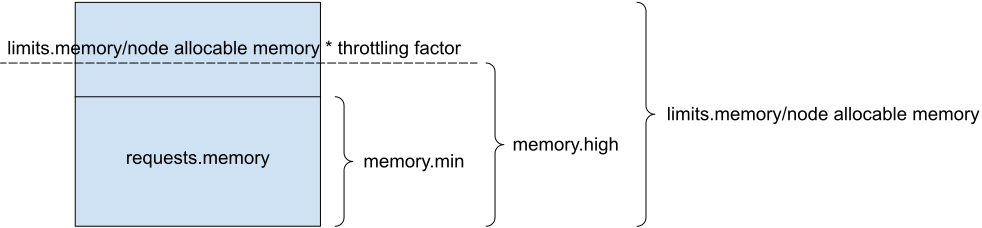

**Authors:** Tim Xu (Tencent Cloud)

Kubernetes v1.22 adds a new (alpha) feature that improves how Linux nodes implement memory resource requests and limits. The new feature relies on cgroups v2 which most current operating system releases for Linux already provide. With this experimental feature, [quality-of-service for pods and containers](/docs/tasks/configure-pod-container/quality-service-pod/) extends to cover not just CPU time but RAM as well.

Kubernetes already has good protection for CPU resources. On Linux nodes, Kubernetes typically sets `cpu_shares`, `cpu_set`, `cpu_quota`, and `cpu_period` to isolate CPU and ensure fairness between workloads. For all resources, Kubernetes allows a workload to define both a _request_ and a _limit_. Existing Kubernetes code already instructs the container runtime to take both settings into account for CPU resources.
	
Before this new feature, Kubernetes didn't do as good a job isolating workloads from each other in terms of RAM use. The existing mechanism only used simple calculations (`memory.limit_in_bytes=sum(pod.spec.containers.resources.limits[memory])` with cgroups v1, or `memory.max=sum(pod.spec.containers.resources.limits[memory])` with cgroups v2) to limit use of the `memory` resource. The kubelet and container runtime didn't consider memory requests at all, only limits.

The kubelet may not be able to guarantee memory resources even when you specify these with a `limit` or a `request` for a Pod or for one of its containers. Because the memory could be overcommitted at the host operating system level, memory pages that are backed by non-volatile storage (such as the executable code for your app) could be dropped from RAM due to overall memory pressure, even when your Pod is running with Guaranteed QoS.

Kubernetes 1.22 introduces a new alpha feature that provides quality-of-service for memory resources. This new feature relies on specific cgroup v2 controls: `memory.min` and `memory.high`. The container runtime uses those capabilities to define a guaranteed amount of RAM for the cgroup overall, as well as to throttle memory requests which is overcommitted. Using memory QoS on your nodes can help you to improve application availability. Setting `memory.min` to match the memory request can help to retain the memory requests to the Pods and containers that it applies to, which is important for latency-sensitive workloads. In addition, setting `memory.high` is to control application memory use in case a large number of memory requests causes the node to become unavailable in an instant.

## How does it work?
It uses two interfaces, `memory.min` and `memory.high` of cgroup v2 memory controller, to work.

<table>
    <tr>
        <th style="text-align:center">File</th>
        <th style="text-align:center">Description</th>
   </tr>
   <tr>
        <td>memory.min</td>
        <td><code>memory.min</code> specifies a minimum amount of memory the cgroup must always retain, i.e., memory that can never be reclaimed by the system. If the cgroup's memory usage reaches this low limit and can’t be increased, the system OOM killer will be invoked.
         
         
        <i>We map it to <code>requests.memory</code></i>
        </td>
   </tr>
   <tr>
       <td>memory.high</td>
       <td><code>memory.high</code> is the memory usage throttle limit. This is the main mechanism to control a cgroup's memory use. If a cgroup's memory use goes over the high boundary specified here, the cgroup’s processes are throttled and put under heavy reclaim pressure. The default is max, meaning there is no limit. 
        
        
       <i>We use a formula to calculate <code>memory.high</code>, depending on <code>limits.memory/node allocatable memory</code> and a memory throttling factor</i>
       </td>
   </tr>
</table>

Both containers and pods are considered. When cgroup v2 unified and MemoryQoS feature gate are both enabled, kubelet sets `requests.memory` to `memory.min` at container and pod level cgroup. And it also sets `memory.high` to throttle container memory overcommit allocation.

The formula is as follows:  
**Container**  

**Pod**  

**QoS**  

The cgroup v2 memory controller enforces memory requests and ceilings per-pod or per-container. If you set. The design of cgroup v2 also implies for the `memory.min` behavior to be as described, all ancestor cgroups must have appropriate `memory.min` values. To ensure this, the kubelet sets `memory.min` on all ancestor cgroups up to the root. You are responsible for ensuring that your init system (or other operating system level tooling) does not also try to manage `memory.min` on those ancestor cgroups.

## How do I use it?
Here are the prerequisites for enabling memory QoS on your Linux node:

1. Kubernetes since v1.22
2. runc since v1.0.0-rc93, containerd since 1.14
3. Linux kernel minimum version: 4.15, recommended version: 5.2+
4. You have enabled the cgroup v2 unified hierarchy (for example: add `systemd.unified_cgroup_hierarchy=1` to the kernel command line)

With those prerequisites met, you can enable the memory QoS feature gate (see [Set kubelet parameters via a config file](/docs/tasks/administer-cluster/kubelet-config-file/).
    
## How can I learn more?

You can find more details as follows:
- [Support Memory QoS with cgroups v2](https://github.com/kubernetes/enhancements/tree/master/keps/sig-node/2570-memory-qos/#readme)
- [cgroups v2](https://github.com/kubernetes/enhancements/tree/master/keps/sig-node/2254-cgroup-v2/#readme)

## How do I get involved?
You can touch us through the community.
- Slack: [#sig-node](https://kubernetes.slack.com/messages/sig-node)
- [Mailing list](https://groups.google.com/forum/#!forum/kubernetes-sig-node)
- [Open Community Issues/PRs](https://github.com/kubernetes/community/labels/sig%2Fnode)

Or you can contact me directly.
- GH / Slack: xiaoxubeii
- Email: xiaoxubeii@gmail.com